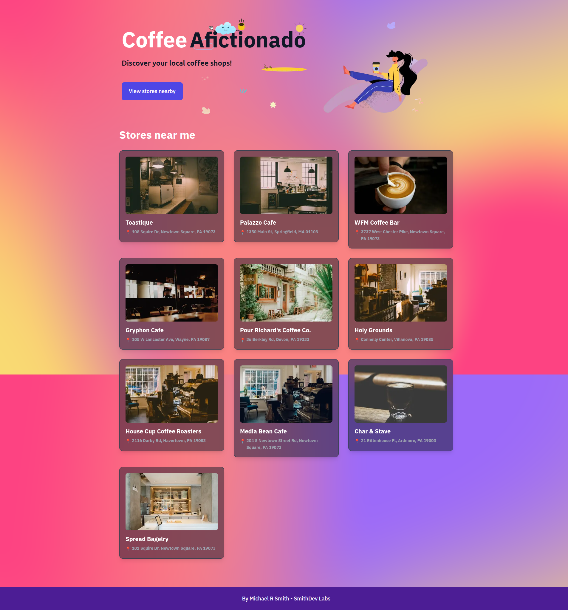

# ☕ CoffeeAficionado - Discover Your Local Coffee Shops!

*Created by **Michael R Smith** - [SmithDev Labs](https://github.com/MSMITH71910)*

A modern, responsive Next.js web application that helps coffee lovers discover amazing local coffee shops anywhere in the world. Built with real-time GPS location detection, rich coffee shop data, and an intuitive user interface.



## ✨ Key Features

### 🗺️ **Smart Location Detection**
- **GPS-Powered Discovery**: Automatically detects your current location using HTML5 Geolocation API
- **Global Coverage**: Works anywhere in the world - from Philadelphia to Paris, Toronto to Tokyo
- **Real-Time Results**: Shows coffee shops in your immediate vicinity as you move around

### 🔍 **Rich Coffee Shop Data**
- **Live Data**: Powered by Google Maps API via SerpApi for accurate, up-to-date information
- **Detailed Information**: Addresses, ratings, reviews, and descriptions for each location
- **Beautiful Images**: High-quality coffee shop photos from Unsplash API

### 💬 **Interactive Community Features**
- **Rating System**: Rate coffee shops from 1-5 stars
- **User Comments**: Share your experiences and read others' reviews  
- **Voting System**: Upvote your favorite coffee shops
- **Persistent Data**: All interactions saved to Airtable database

### 📱 **Modern User Experience**
- **Responsive Design**: Seamless experience on desktop, tablet, and mobile devices
- **Beautiful UI**: Gradient backgrounds and smooth animations built with Tailwind CSS
- **Fast Loading**: Optimized performance with Next.js 15 and React 19
- **TypeScript**: Full type safety for reliable code

## 🛠️ Technical Architecture

### **Frontend Stack**
- **Next.js 15** - React framework with App Router and server-side rendering
- **React 19** - Latest React features with improved performance
- **TypeScript** - Full type safety and better developer experience  
- **Tailwind CSS** - Utility-first CSS framework for rapid styling

### **Backend & APIs**
- **Next.js API Routes** - Serverless API endpoints
- **SerpApi** - Google Maps data for real coffee shop information
- **Unsplash API** - High-quality coffee shop photography
- **Airtable API** - Database for user-generated content (ratings, comments, votes)

### **Location Technology**
- **HTML5 Geolocation API** - Browser-based GPS location detection
- **Coordinate Processing** - Converts GPS coordinates to location-specific results
- **Global Compatibility** - Works with any valid latitude/longitude coordinates worldwide

### **Deployment & Infrastructure**  
- **Vercel Platform** - Serverless deployment with automatic CI/CD
- **Environment Security** - All API keys secured in environment variables
- **Production Optimization** - Built-in caching, compression, and performance optimizations

## 🚀 Live Demo

🌐 **[Visit CoffeeAficionado](https://discover-coffee-stores-pied.vercel.app/)**

Test the location detection:
- Allow location access when prompted
- Click "View stores nearby" 
- Explore coffee shops in your area!

## ⚡ Quick Start

### Prerequisites
- Node.js 18+
- npm or yarn
- API keys (instructions below)

### 1. Clone & Install
```bash
git clone https://github.com/MSMITH71910/discover-coffee-stores.git
cd discover-coffee-stores
npm install
```

### 2. Environment Setup
Create `.env.local` file:
```env
# Required API Keys
SERP_API_KEY=your_serpapi_key_here
UNSPLASH_ACCESS_KEY=your_unsplash_access_key
AIRTABLE_TOKEN=your_airtable_personal_access_token
AIRTABLE_BASE_ID=your_airtable_base_id

# Site Configuration  
NEXT_PUBLIC_SITE_URL=http://localhost:3000
```

### 3. Get API Keys

**SerpApi** (Google Maps Data)
1. Sign up at [serpapi.com](https://serpapi.com)
2. Get your free API key from dashboard
3. 100 searches/month free tier

**Unsplash** (Coffee Shop Photos)  
1. Create account at [unsplash.com/developers](https://unsplash.com/developers)
2. Create new application
3. Copy Access Key

**Airtable** (Database)
1. Sign up at [airtable.com](https://airtable.com)
2. Create new base with tables: `coffee-stores`, `comments`
3. Get Personal Access Token from account settings
4. Copy Base ID from API documentation

### 4. Run Development Server
```bash
npm run dev
# Visit http://localhost:3000
```

## 🏗️ Project Structure

```
discover-coffee-stores/
├── app/                          # Next.js App Router
│   ├── api/                     # API endpoints
│   ├── coffee-store/[id]/       # Dynamic coffee shop pages
│   ├── globals.css              # Global styles
│   ├── layout.tsx               # Root layout
│   └── page.tsx                 # Homepage
├── components/                   # React components
│   ├── banner.client.tsx        # Location detection UI
│   ├── card.client.tsx          # Coffee shop cards
│   ├── card.server.tsx          # Server-side cards
│   └── nearby-coffee-stores.client.tsx  # Main app logic
├── hooks/                       # Custom React hooks
│   └── use-track-location.tsx   # GPS location detection
├── lib/                         # Utility functions
│   ├── airtable.ts             # Database operations
│   └── coffee-stores.ts         # Data fetching logic
├── types/                       # TypeScript definitions
│   └── index.ts                # Type definitions
└── public/                      # Static assets
```

## 🔧 API Reference

### Core Endpoints

#### `GET /api/getCoffeeStoresByLocation`
Fetch coffee shops by GPS coordinates
```javascript
// Example request
fetch('/api/getCoffeeStoresByLocation?longLat=-75.4037,39.9876&limit=10')
```

#### `POST /api/coffee-stores`
Create or update coffee store data
```javascript
fetch('/api/coffee-stores', {
  method: 'POST',
  body: JSON.stringify({ id, name, address, ... })
})
```

#### `POST /api/coffee-stores/vote`  
Vote for a coffee shop
```javascript
fetch('/api/coffee-stores/vote', {
  method: 'POST', 
  body: JSON.stringify({ id })
})
```

#### `POST /api/coffee-stores/comments`
Add rating and comment
```javascript
fetch('/api/coffee-stores/comments', {
  method: 'POST',
  body: JSON.stringify({ id, comment, rating })
})
```

## 📱 How It Works

### 1. **Location Detection**
- User clicks "View stores nearby"
- Browser requests GPS permission  
- HTML5 Geolocation API gets precise coordinates
- Coordinates sent to backend API

### 2. **Data Fetching**
- SerpApi searches Google Maps for "coffee shop" near coordinates
- Returns real business data (names, addresses, ratings)
- Unsplash API adds beautiful coffee shop photos
- Results formatted and returned to frontend

### 3. **User Interaction**  
- Users can click any coffee shop to view details
- Rating system allows 1-5 star reviews
- Comment system for sharing experiences
- Voting system to highlight favorites
- All data persisted to Airtable database

### 4. **Responsive Display**
- Grid layout adapts to screen size
- Cards show essential information at a glance
- Smooth animations and hover effects
- Optimized for mobile and desktop

## 🚀 Deployment Guide

### Vercel Deployment (Recommended)

1. **Connect Repository**
   ```bash
   # Push to GitHub
   git add .
   git commit -m "Initial commit"  
   git push origin main
   ```

2. **Deploy to Vercel**
   - Visit [vercel.com](https://vercel.com)
   - Import your GitHub repository
   - Add environment variables from `.env.local`
   - Set `NEXT_PUBLIC_SITE_URL` to your Vercel domain
   - Deploy!

3. **Post-Deployment**
   - Test location detection on live site
   - Verify API endpoints working
   - Check database connections

## 🎯 Development Highlights

### **Location-First Architecture**
Built the entire application around precise GPS location detection, ensuring users always see relevant, nearby coffee shops no matter where they are in the world.

### **Real-Time Data Integration** 
Integrated multiple APIs (SerpApi, Unsplash, Airtable) to provide rich, up-to-date coffee shop information with beautiful visuals and user-generated content.

### **Performance Optimization**
Implemented Next.js 15 App Router with server-side rendering, optimized images, and efficient API caching for fast load times.

### **Type-Safe Development**
Used TypeScript throughout the entire codebase to catch errors early and provide better developer experience with autocomplete and type checking.

### **Responsive Design System**
Created a mobile-first design with Tailwind CSS that works seamlessly across all device sizes and screen orientations.

## 📊 Features in Detail

### **Smart Location Detection**
- Detects user's exact GPS coordinates
- Handles location permission requests gracefully  
- Falls back gracefully if location is denied
- Works on both mobile and desktop browsers

### **Rich Coffee Shop Data**
- Real business information from Google Maps
- High-quality photography from Unsplash
- Ratings, reviews, and business descriptions
- Accurate addresses and contact information

### **Community Features**
- 5-star rating system for user feedback
- Comment system for sharing experiences  
- Voting system to highlight popular spots
- All data persisted and shareable

### **Global Compatibility**
- Works anywhere in the world with GPS
- Supports international address formats
- Currency and language agnostic design
- Tested across multiple geographic regions

## 👨‍💻 About the Developer

**Michael R Smith** is a full-stack developer specializing in modern web technologies. This project showcases expertise in:

- **Frontend Development**: React, Next.js, TypeScript, Tailwind CSS
- **Backend Development**: Node.js, API integration, database design
- **Mobile-First Design**: Responsive layouts, cross-browser compatibility  
- **Third-Party Integration**: REST APIs, geolocation services
- **Production Deployment**: Vercel, environment management, CI/CD

*More projects available at [SmithDev Labs](https://github.com/MSMITH71910)*

## 📄 License

This project is licensed under the MIT License - see the [LICENSE](LICENSE) file for details.

---

*Built with ❤️ for coffee lovers everywhere*

**[🌐 Live Site](https://discover-coffee-stores-pied.vercel.app/)** | **[📧 Contact](mailto:smith.dev.labs@gmail.com)** | **[💼 More Projects](https://github.com/MSMITH71910)**